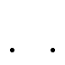
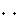

# Proposal for Emoji: Bull Horns

**Submitter:** levonk

**Date:** 2026-09-14

---

## I. Identification

**Proposed Unicode and CLDR name:** Bull Horns

**Keywords:** animal, bull, cattle, cow, horn, horns, livestock, ox, strength, taurus

**Category:** Animals & Nature — animal-mammal (as a body-part emoji, analogous to 🐽 pig nose, 🦴 bone, 🫀 anatomical heart)

---

## II. Images

### Color example images

| 72px | 18px |
|---|---|
|  |  |

### Black & white example images

| 72px | 18px |
|---|---|
|  |  |

**License:** The Submitter certifies that the example images are the Submitter's own
original work, created with the assistance of programmatic drawing tools, and that
the Submitter owns all IP Rights in the images. The images are suitable for
incorporation into the Unicode Standard.

---

## III. Sort location

Animals & Nature — animal-mammal (near 🐂 ox U+1F402, 🐃 water buffalo U+1F403,
🦬 bison U+1F9AC, 🐏 ram U+1F40F) or Objects — as a standalone horn object

---

## IV. Selection factors — Inclusion

### A. Multiple meanings

Bull horns convey several distinct concepts:

1. **Animal body part:** Horns are a defining feature of bulls, cows, rams, and
   other bovines/ungulates — used for defense, dominance displays, and species
   identification.
2. **Strength / power:** Bull horns are a universal symbol of strength,
   determination, and aggressive power across cultures ("taking the bull by the
   horns").
3. **Zodiac (Taurus):** Bull horns are the central element of the Taurus zodiac
   glyph (♉ U+2649), which depicts a bull's head with horns. Taurus season
   (April 20–May 20) generates significant cultural activity.
4. **Cultural / mythological:** Bull horns appear in mythology worldwide — the
   Mesopotamian "Great Bull of Heaven," the Minotaur, Minoan bull-leaping, and
   modern bullfighting traditions.
5. **Decor / craft:** Bull horns are used as decorative objects, drinking horns,
   and musical instruments (shofar).
6. **Costume / cosplay:** Bull horn headbands are popular costume accessories
   (Halloween, cosplay, festivals).

### B. Use in sequences

- 🐂🦬 — bull/cattle (ox + horns)
- 🫂💪 — strength / "take the bull by the horns"
- ♉🫂 — Taurus zodiac (Taurus glyph + horns)
- 🫂🎃 — bull horn costume (Halloween)
- 🫂😡 — charging bull / angry

### C. Breaks new ground

**Yes.** There is no existing emoji for a standalone pair of bull horns. The
closest existing emoji are:

- 🤘 **sign of the horns** (U+1F918) — a *hand gesture* (pinky and index finger
  raised), not actual animal horns. It is classified under People & Body →
  hand-fingers-partial and represents a rock/metal music gesture, not a physical
  horn object.
- ♉ **Taurus** (U+2649) — a zodiac *symbol/glyph* (a circle with horns), not a
  depiction of actual horns.
- 🐂 **ox** (U+1F402), 🐃 **water buffalo** (U+1F403), 🐏 **ram** (U+1F40F) —
  full animal emoji that include horns as part of the body, but cannot convey
  "horns" as a standalone concept (strength, costume, decor, symbol).

A standalone bull horns emoji fills a gap in the "animal body part" subcategory,
analogous to how 🐽 pig nose (U+1F43D) is a standalone snout, 🦴 bone (U+1F9B4) is
a standalone skeletal element, and 🫀 anatomical heart (U+1FAC0) is a standalone
organ. It enables expressions (strength, Taurus, costume, "take the bull by the
horns") that full-animal emoji cannot convey.

### D. Image distinctiveness

The bull horns emoji depicts a pair of curved horns rising from a base, resembling
the iconic shape of a bull's horns. At 18×18 pixels, the two curved horns
symmetrically rising are recognizable. It is distinct from:

- 🤘 sign of the horns (a hand with fingers extended — clearly a hand, not horns)
- ♉ Taurus (a simple circle-with-horns glyph, not a depiction of actual horns)
- 🐂 ox (a full animal body, not standalone horns)

### E. Usage level — Frequency

**Evidence of frequency** (see `data-collection/frequency-evidence.md` for full
URLs and screenshots to capture):

1. **Google Search:** [bull-horns](https://www.google.com/search?q=bull-horns) —
   millions of results.
2. **Google Video Search:**
   [bull-horns videos](https://www.google.com/search?tbm=vid&q=bull-horns) —
   videos on bull horn crafts, biology, cultural symbolism.
3. **Google Trends (Web):**
   [elephant vs bull-horns](https://trends.google.com/trends/explore?date=all&q=elephant,bull-horns) —
   sustained interest with seasonal spikes around Taurus season (April–May) and
   Halloween.
4. **Google Trends (Image):**
   [elephant vs bull-horns images](https://trends.google.com/trends/explore?date=all_2008&gprop=images&q=elephant,bull-horns)
5. **Google Books Ngram:**
   [elephant vs bull-horns](https://books.google.com/ngrams/graph?content=elephant%2Cbull-horns&year_start=1500&year_end=2019&corpus=en-2019&smoothing=3)

**Cultural significance:** Bull horns are the central symbol of Taurus (♉), one of
the 12 zodiac signs. The Taurus glyph (U+2649) is already encoded in Unicode and
depicts a bull's head with horns. Bull horns symbolize strength, determination,
and power across cultures — from the Mesopotamian "Great Bull of Heaven" to modern
ranching and bullfighting (Source: Wikipedia, Emojipedia).

### F. Completeness

n/a — Bull horns do not complete a fixed set, but they fill a gap in the animal
body part subcategory alongside 🐽 pig nose, 🐾 paw prints, 🦴 bone, and 🫀
anatomical heart.

### G. Compatibility

n/a — Not proposed for compatibility with a specific existing system.

---

## V. Selection factors — Exclusion

### A. Already representable

Bull horns are **not** already representable as a standalone concept:

- 🤘 **sign of the horns** (U+1F918) is a *hand gesture* — it depicts a human hand
  with the pinky and index finger raised. It is classified under People & Body →
  hand-fingers-partial and represents a rock/metal music gesture. It is not a pair
  of animal horns and cannot convey "actual horns," "strength," "Taurus," or
  "bull costume."
- ♉ **Taurus** (U+2649) is a zodiac *symbol/glyph* — a stylized circle with horns.
  It represents the astrological sign, not a depiction of physical horns.
- 🐂 **ox** (U+1F402), 🐃 **water buffalo** (U+1F403), 🐏 **ram** (U+1F40F) are
  full animal emoji. They include horns as part of the body but cannot convey
  "horns" as a standalone concept.
- No sequence of existing emoji conveys "a standalone pair of bull horns."

### B. Overly specific

No. "Bull horns" is a general, iconic concept — the curved horns of a bull —
applicable to strength symbolism, Taurus zodiac, costume accessories, decor, and
cultural references. It is not specific to one breed or one cultural context. It
represents the general category of bovine horns, analogous to how 🐽 pig nose
represents snouts in general.

### C. Open-ended

No. "Bull horns" is a single, well-defined object. Adding it does not create
pressure to add "deer antlers," "rhino horn," "ram horns," or other horn types —
those are distinct objects with different shapes and cultural meanings. Bull
horns are one of the most iconic and universally recognized horn shapes,
comparable to 🐽 pig nose and 🦴 bone which were already encoded as standalone
body parts.

### D. Transient

No. Bull horns have been a symbol of strength and power for millennia, from
ancient Mesopotamian mythology to modern zodiac culture and ranching. Their
usage is deeply embedded in culture and is not faddish.

### E. Faulty comparison

This proposal is not justified by similarity to the sign of the horns hand gesture
or the Taurus zodiac glyph. It stands on its own frequency and distinctiveness
evidence. The existence of 🤘 sign of the horns (a hand gesture) and ♉ Taurus (a
zodiac glyph) does not justify this proposal; rather, bull horns fills a distinct
gap as a standalone physical object / body part. The relationship is
complementary: 🤘 is a *gesture*, ♉ is a *symbol*, and bull horns is a *physical
object* — the same distinction that exists between 👋 waving hand (a gesture) and
🤚 raised hand (a body part).

---

## VI. Other information

### Design considerations

- The emoji should depict a pair of curved bull horns rising symmetrically from a
  small base, resembling the iconic shape of a bull's horns.
- A tan/ivory or brown color scheme is typical for natural horns.
- At 18×18 pixels, the key distinguishing features are: two curved horns rising
  symmetrically from a central base.
- The design should be distinct from 🤘 sign of the horns (a hand with fingers)
  and ♉ Taurus (a simple circle-with-horns glyph).

### Sort location

Animals & Nature → animal-mammal, placed near 🐂 ox (U+1F402), 🐃 water buffalo
(U+1F403), 🐏 ram (U+1F40F), and 🦬 bison (U+1F9AC), as it is a standalone animal
body part. Alternatively, Objects → if classified as a standalone horn object.
