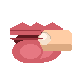
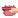
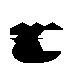

# Proposal for Emoji: Nail Biting

**Submitter:** levonk

**Date:** 2026-09-14

---

## I. Identification

**Proposed Unicode and CLDR name:** Nail Biting

**Keywords:** anxious, bite, biting, chew, chewed, finger, fingernail, habit, lip, nail, nervous, onychophagia, stress, worry

**Category:** People & Body — hand-fingers-partial

---

## II. Images

### Color example images

| 72px | 18px |
|---|---|
|  |  |

### Black & white example images

| 72px | 18px |
|---|---|
|  |  |

**License:** The Submitter certifies that the example images are the Submitter's own
original work, created with the assistance of programmatic drawing tools, and that
the Submitter owns all IP Rights in the images. The images are suitable for
incorporation into the Unicode Standard.

---

## III. Sort location

People & Body — hand-fingers-partial (near 💅 nail polish, 🤳 selfie)

---

## IV. Selection factors — Inclusion

### A. Multiple meanings

Nail biting conveys several distinct concepts:

1. **Nervousness / anxiety:** The most common metaphorical use — biting one's nails
   signals stress, worry, or anticipation ("I was biting my nails waiting for the
   results").
2. **Impatience / suspense:** The idiom "biting one's nails" universally signals
   waiting anxiously for an outcome.
3. **Habit / compulsion:** Onychophagia is a recognized body-focused repetitive
   behavior (BFRB), used in medical and self-help contexts.
4. **Flirting / coy expression:** In some contexts, nail biting is used as a
   flirtatious or self-conscious gesture (cf. the "sexy" keyword on 🫦 biting lip).

### B. Use in sequences

- 😬🤏 — nervous nail biting (anxious face + nail biting gesture)
- 💅🤏 — nail care gone wrong (nail polish + biting)
- 🤏😰 — stress-induced nail biting
- 🤏📝 — exam stress (nail biting + memo)
- 🤏🫦 — nervous lip and nail biting combo

### C. Breaks new ground

**Yes.** There is no existing emoji that depicts the action of nail biting. The
closest existing emoji are:

- 💅 **nail polish** (U+1F485) — depicts painting nails, a cosmetic/grooming
  action, not a nervous habit.
- 🫦 **biting lip** (U+1FAE6) — depicts biting one's lip (anxiety/flirting), a
  different body part and gesture.
- 😬 **grimacing face** (U+1F62C) — a facial expression, not an action involving
  hands.

Nail biting is a distinct hand-to-mouth action involving fingers and teeth, not
representable by any existing emoji or sequence. It fills a gap in the
"hand-fingers-partial" and "face-hand" categories.

### D. Image distinctiveness

The nail biting emoji depicts a hand with a finger raised to the mouth in a biting
posture. The combination of a visible finger/hand at the mouth with a nail being
bitten is visually distinctive and recognizable at 18×18 pixels. The gesture is
universally understood across cultures as nail biting, distinct from 🤳 selfie
(phone, not mouth), 💅 nail polish (bottle, not biting), and 🫦 biting lip (lips
only, no hand).

### E. Usage level — Frequency

**Evidence of frequency** (see `data-collection/frequency-evidence.md` for full
URLs and screenshots to capture):

1. **Google Search:** [nail-biting](https://www.google.com/search?q=nail-biting) —
   tens of millions of results.
2. **Google Video Search:**
   [nail-biting videos](https://www.google.com/search?tbm=vid&q=nail-biting) —
   thousands of results (cessation tutorials, anxiety content, nail care).
3. **Google Trends (Web):**
   [elephant vs nail-biting](https://trends.google.com/trends/explore?date=all&q=elephant,nail-biting) —
   sustained year-round interest with seasonal spikes (exam periods).
4. **Google Trends (Image):**
   [elephant vs nail-biting images](https://trends.google.com/trends/explore?date=all_2008&gprop=images&q=elephant,nail-biting)
5. **Google Books Ngram:**
   [elephant vs nail-biting](https://books.google.com/ngrams/graph?content=elephant%2Cnail-biting&year_start=1500&year_end=2019&corpus=en-2019&smoothing=3)

**Prevalence data:** Nail biting (onychophagia) affects approximately 20–30% of
the general population, with rates up to 41% among children and up to 57% among
university students (Source: Springer Nature cross-sectional study, 2025;
Acta Dermato-Venereologica, 2014). This is a universally recognized behavior
across cultures.

### F. Completeness

n/a — Nail biting does not complete a fixed set, but it fills a gap in the
hand-to-mouth action category alongside 🫦 biting lip and 💅 nail polish.

### G. Compatibility

n/a — Not proposed for compatibility with a specific existing system.

---

## V. Selection factors — Exclusion

### A. Already representable

Nail biting is **not** already representable:

- 💅 nail polish depicts painting nails, not biting them.
- 🫦 biting lip depicts lip biting, not nail biting — different body part, different
  gesture, different psychological connotation.
- 😬 grimacing face is a facial expression, not an action.
- No sequence of existing emoji conveys "finger in mouth, biting nail."

### B. Overly specific

No. Nail biting is a general, universally recognized behavior, not a specific
subtype. It represents the entire category of nail-biting behavior (onychophagia).

### C. Open-ended

No. Nail biting is a single, well-defined action. Adding it does not create
pressure to add "toe biting," "cuticle picking," or other variants — those are
distinct concepts with much lower usage.

### D. Transient

No. Nail biting has been documented for centuries and is a stable, recognized
behavior in medical, psychological, and everyday contexts. Its usage is not
faddish.

### E. Faulty comparison

This proposal is not justified by similarity to existing emoji. It stands on its
own frequency and distinctiveness evidence. The existence of 💅 nail polish and
🫦 biting lip does not justify this proposal; rather, nail biting fills a distinct
gap they do not cover.

---

## VI. Other information

### Design considerations

- The emoji depicts a close-up of a mouth (lips) biting a finger, styled like
  🫦 biting lip but with a finger entering the mouth from the side. This visual
  parallel makes the relationship to 🫦 immediately clear while distinguishing it
  by the presence of the finger and visible fingernail.
- The finger enters horizontally from the right, with the fingernail (the part
  being bitten) visible at the lip line.
- Skin tone support (FITZPATRICK) should be supported via emoji modifier
  sequences, as the finger is a prominent element.
- At 18×18 pixels, the key distinguishing features are: lips + a finger
  crossing into the mouth with a visible nail.
- The design parallels 🫦 biting lip (lips only) by using the same close-up mouth
  composition, adding the finger/nail as the distinguishing element.

### Sort location

People & Body → hand-fingers-partial, placed near 💅 nail polish (U+1F485) and
🤳 selfie (U+1F933), as it involves hands and self-referential body action.
