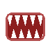
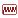
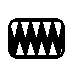

# Proposal for Emoji: Sharp Teeth

**Submitter:** levonk

**Date:** 2026-09-14

---

## I. Identification

**Proposed Unicode and CLDR name:** Sharp Teeth

**Keywords:** bite, canine, carnivore, chomp, dangerous, dental, fang, gnash, halloween, monster, mouth, predator, scary, snarl, teeth, tooth, werewolf

**Category:** Smileys & Emotion — face-concerned (as a mouth/expression element) or
People & Body — body-parts (as a teeth/mouth element)

---

## II. Images

### Color example images

| 72px | 18px |
|---|---|
|  |  |

### Black & white example images

| 72px | 18px |
|---|---|
|  |  |

**License:** The Submitter certifies that the example images are the Submitter's own
original work, created with the assistance of programmatic drawing tools, and that
the Submitter owns all IP Rights in the images. The images are suitable for
incorporation into the Unicode Standard.

---

## III. Sort location

Smileys & Emotion — face-concerned (near 😬 grimacing face, 😬 face with open mouth)
or People & Body — body-parts (near 🦷 tooth U+1F9B7, 👄 mouth U+1F444)

---

## IV. Selection factors — Inclusion

### A. Multiple meanings

Sharp teeth convey several distinct concepts:

1. **Danger / threat:** Pointed teeth signal aggression, predation, or danger
   ("showing teeth," "bare fangs").
2. **Monster / supernatural:** Sharp teeth are the universal visual shorthand for
   monsters, werewolves, demons, and creatures in horror, fantasy, and Halloween
   contexts.
3. **Halloween / costume:** "Sharp teeth" / "fangs" are among the most popular
   Halloween costume accessories (vampire, werewolf, monster teeth prosthetics).
4. **Predatory animals:** Sharp teeth describe carnivores, predators, and
   dinosaurs in educational and nature contexts.
5. **Aggressive expression:** Baring sharp teeth is a universal aggressive facial
   expression across human and animal communication.

### B. Use in sequences

- 🦷😈 — monster teeth (tooth + smiling devil)
- 👹🦷 — demon/oni with sharp teeth
- 🧛🦷 — vampire (vampire + teeth element)
- 🐺🦷 — werewolf (wolf + sharp teeth)
- 🦷🎃 — Halloween (sharp teeth + jack-o-lantern)
- 🦷😱 — scary teeth / horror

### C. Breaks new ground

**Yes.** There is no existing emoji for sharp/pointed teeth as a standalone mouth
or dental element. The closest existing emoji are:

- 🦷 **tooth** (U+1F9B7) — a single, generic white tooth (molar/incisor shape),
  not sharp or menacing.
- 🧛 **vampire** (U+1F9DB) — a full character (person in costume) with fangs,
  not a standalone teeth/mouth element.
- 😬 **grimacing face** (U+1F62C) — a facial expression with flat teeth, not
  pointed/sharp.
- 👹 **ogre** (U+1F479) — a full character with horns, not a standalone teeth
  element.

Sharp teeth as a standalone mouth/teeth element is distinct from the vampire
character (which is a full person in costume) and from the generic tooth emoji
(which is a single, non-threatening molar). It represents the concept of pointed,
menacing teeth — usable with monsters, predators, Halloween, and aggressive
expressions — without requiring a full character emoji.

### D. Image distinctiveness

The sharp teeth emoji depicts an open mouth with rows of pointed, triangular teeth
visible. At 18×18 pixels, the open mouth with triangular white teeth on a dark/red
interior is recognizable. It is distinct from:

- 🦷 tooth (single tooth, not a mouth/row)
- 🧛 vampire (full character with cape, not a mouth element)
- 😬 grimacing face (flat teeth, full face, not pointed)
- 👄 mouth (closed/smiling lips, no teeth visible)

### E. Usage level — Frequency

**Evidence of frequency** (see `data-collection/frequency-evidence.md` for full
URLs and screenshots to capture):

1. **Google Search:** [sharp-teeth](https://www.google.com/search?q=sharp-teeth) —
   millions of results.
2. **Google Video Search:**
   [sharp-teeth videos](https://www.google.com/search?tbm=vid&q=sharp-teeth) —
   videos on animal teeth, Halloween costumes, monster makeup.
3. **Google Trends (Web):**
   [elephant vs sharp-teeth](https://trends.google.com/trends/explore?date=all&q=elephant,sharp-teeth) —
   interest with seasonal Halloween spikes (October).
4. **Google Trends (Image):**
   [elephant vs sharp-teeth images](https://trends.google.com/trends/explore?date=all_2008&gprop=images&q=elephant,sharp-teeth)
5. **Google Books Ngram:**
   [elephant vs sharp-teeth](https://books.google.com/ngrams/graph?content=elephant%2Csharp-teeth&year_start=1500&year_end=2019&corpus=en-2019&smoothing=3)

**Halloween/costume usage:** "Sharp teeth" and "fangs" are among the most popular
Halloween costume accessories. Halloween fangs are temporary fake teeth that
transform a costume into vampire, werewolf, or monster looks (Source: Morphsuits,
Liquid Octopus, Tinsley Transfers product listings). The term also appears
extensively in biology (predator dentition), children's books, and horror fiction.

### F. Completeness

n/a — Sharp teeth does not complete a fixed set, but it fills a gap in the
mouth/teeth element category alongside 🦷 tooth (U+1F9B7) and 👄 mouth (U+1F444).

### G. Compatibility

n/a — Not proposed for compatibility with a specific existing system.

---

## V. Selection factors — Exclusion

### A. Already representable

Sharp teeth are **not** already representable as a standalone concept:

- 🧛 **vampire** (U+1F9DB) is a full character (person in vampire costume with
  cape). It has "fangs" as a CLDR keyword, but it represents the *character* of a
  vampire, not the concept of sharp/pointed teeth in general. It cannot be used to
  represent a werewolf's teeth, a predator's teeth, a monster's teeth, or a
  Halloween costume accessory without also implying "vampire person."
- 🦷 **tooth** (U+1F9B7) is a single, generic, non-threatening molar — not sharp,
  not a mouth, not menacing.
- 😬 **grimacing face** (U+1F62C) shows flat teeth in a full facial expression —
  not pointed teeth as a standalone element.
- 👹 **ogre** / 👺 **goblin** are full characters, not standalone teeth.

The distinction between "sharp teeth" (a mouth/teeth element) and "vampire" (a
character) is analogous to the distinction between 🦷 tooth (a body part) and
🧑 person (a full character). Sharp teeth can be combined with many characters
(werewolf 🐺, demon 👹, ogre 👹, monster 👾) in ways the vampire emoji alone cannot.

### B. Overly specific

No. "Sharp teeth" is a general concept — pointed, menacing teeth — applicable to
monsters, predators, Halloween costumes, and aggressive expressions. It is not
specific to one character (e.g., not "Dracula's fangs" or "werewolf fangs"). It
represents the entire category of pointed/dangerous teeth.

### C. Open-ended

No. "Sharp teeth" is a single, well-defined concept. Adding it does not create
pressure to add "flat teeth," "crooked teeth," "gold teeth," or other dental
variants — those are distinct concepts with different usage contexts.

### D. Transient

No. Sharp/pointed teeth have been a universal symbol of danger, monsters, and
predators across cultures for centuries (folklore, mythology, horror literature).
Halloween usage is seasonal but the concept itself is perennial in horror,
fantasy, and nature contexts.

### E. Faulty comparison

This proposal is not justified by similarity to the vampire emoji. It stands on
its own frequency and distinctiveness evidence. The existence of 🧛 vampire does
not justify this proposal; rather, sharp teeth fills a distinct gap as a
standalone teeth/mouth element that can be used independently of any specific
character. The relationship is complementary, not comparative: 🧛 vampire is a
*character*, while sharp teeth is a *body part / expression element* — the same
relationship that exists between 🧑 person and 🦷 tooth.

---

## VI. Other information

### Naming rationale

This proposal was originally conceived as "fangs" but was renamed to "Sharp Teeth"
to avoid overlap with the existing 🧛 vampire emoji (U+1F9DB), which has "fangs" as
a CLDR keyword. "Sharp Teeth" is a broader, more descriptive term that:
- Avoids the "Already Representable" concern with the vampire emoji's "fangs"
  keyword.
- Encompasses a wider range of concepts (monsters, predators, Halloween costumes,
  aggressive expressions) beyond just vampire fangs.
- Follows the Unicode guideline preference for descriptive names ("Sharp Teeth")
  over prescriptive ones ("Fangs").

### Design considerations

- The emoji should depict an open mouth with visible rows of pointed, triangular
  teeth (upper and lower).
- White teeth on a dark red/black mouth interior provides strong contrast.
- At 18×18 pixels, the key distinguishing features are: open mouth shape, pointed
  triangular teeth visible.
- The design should be distinct from 🦷 tooth (single tooth), 😬 grimacing face
  (flat teeth, full face), and 👄 mouth (lips only).

### Sort location

People & Body → body-parts, placed near 🦷 tooth (U+1F9B7) and 👄 mouth (U+1F444),
as it is a mouth/teeth element. Alternatively, Smileys & Emotion → face-concerned,
near 😬 grimacing face, if classified as an expression.
