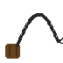
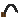

# Proposal for Emoji: Whip

**Submitter:** levonk

**Date:** 2026-09-14

---

## I. Identification

**Proposed Unicode and CLDR name:** Whip

**Keywords:** bullwhip, crack, crop, equestrian, flog, horse, lash, leather, punish, riding, strike, whip

**Category:** Objects — tool

---

## II. Images

### Color example images

| 72px | 18px |
|---|---|
|  |  |

### Black & white example images

| 72px | 18px |
|---|---|
|  |  |

**License:** The Submitter certifies that the example images are the Submitter's own
original work, created with the assistance of programmatic drawing tools, and that
the Submitter owns all IP Rights in the images. The images are suitable for
incorporation into the Unicode Standard.

---

## III. Sort location

Objects — tool (near 🔨 hammer, 🪓 axe, 🛠️ tools)

---

## IV. Selection factors — Inclusion

### A. Multiple meanings

The whip conveys several distinct concepts:

1. **Equestrian / riding aid:** A tool used in horseback riding for subtle cues and
   direction (the most common modern physical use).
2. **Authority / discipline:** Metaphorically, "to whip" means to drive, urge, or
   enforce discipline ("whip into shape," "party whip" in parliamentary procedure).
3. **Speed / quickness:** "Whip" conveys rapid motion ("whip up," "whip through,"
   "whip up a meal").
4. **Cooking:** "Whipping" is a fundamental culinary technique (whipped cream,
   whipping eggs).
5. **Performance / entertainment:** Whip cracking is a performance art and sport
   (e.g., Indiana Jones, circus acts).
6. **Music / dance:** "Whip/Nae Nae" is a popular dance; "whip" has slang meanings
   in car culture ("whip" = car).

### B. Use in sequences

- 🐴🪢 — horse riding with whip (equestrian)
- 🪢💪 — whip into shape (discipline/strength)
- 🪢🍰 — whipping cream / baking
- 🪢🎵 — whip dance / music
- 🪢🦬 — cattle driving (whip + bison/ox)

### C. Breaks new ground

**Yes.** There is no existing emoji for a whip or any similar striking/lashing tool.
The closest existing emoji are:

- 🪢 **knot** (U+1FAA0) — an abstract knot, not a tool.
- 🔨 **hammer** (U+1F528) — a striking tool, but for driving nails, not a lash.
- 🏇 **horse racing** (U+1F3C7) — a person riding a horse, no whip visible.

A whip is a fundamentally different object — a flexible lash attached to a handle —
not representable by any existing emoji or sequence. It fills a gap in the
"tool" category.

### D. Image distinctiveness

The whip emoji depicts a handle with a long, curved lash extending outward. The
shape is visually distinctive: a short handle with a long, sinuous line. At 18×18
pixels, the curved lash and handle are recognizable. It is distinct from 🪢 knot
(abstract loop), 🔨 hammer (rigid head), and 🏇 horse racing (full person on horse).

### E. Usage level — Frequency

**Evidence of frequency** (see `data-collection/frequency-evidence.md` for full
URLs and screenshots to capture):

1. **Google Search:** [whip](https://www.google.com/search?q=whip) — hundreds of
   millions of results.
2. **Google Video Search:**
   [whip videos](https://www.google.com/search?tbm=vid&q=whip) — extensive results
   (whip cracking, equestrian, cooking, entertainment).
3. **Google Trends (Web):**
   [elephant vs whip](https://trends.google.com/trends/explore?date=all&q=elephant,whip) —
   "whip" significantly exceeds "elephant" in search volume.
4. **Google Trends (Image):**
   [elephant vs whip images](https://trends.google.com/trends/explore?date=all_2008&gprop=images&q=elephant,whip)
5. **Google Books Ngram:**
   [elephant vs whip](https://books.google.com/ngrams/graph?content=elephant%2Cwhip&year_start=1500&year_end=2019&corpus=en-2019&smoothing=3)

**Historical usage:** The word "whip" dates to Middle English (c. 1325) and has
been continuously used across Christianity, medicine, cooking, parliament,
mechanics, and equestrianism (Source: Oxford English Dictionary). It appears far
more frequently than "elephant" in historical literature.

### F. Completeness

n/a — The whip does not complete a fixed set, but it fills a gap in the tool/weapon
category alongside 🔨 hammer, 🪓 axe, 🏹 bow and arrow, ⚔️ crossed swords, and 🔪
kitchen knife.

### G. Compatibility

n/a — Not proposed for compatibility with a specific existing system.

---

## V. Selection factors — Exclusion

### A. Already representable

The whip is **not** already representable:

- 🪢 knot is an abstract knot, not a tool.
- 🔨 hammer is a rigid striking tool, not a flexible lash.
- 🏇 horse racing shows a rider but no whip.
- No sequence of existing emoji conveys "a flexible lash on a handle."

### B. Overly specific

No. "Whip" is a general category of tool with centuries of use across cultures. It
is not a specific brand or subtype. The emoji represents whips in general
(bullwhips, riding crops, lunge whips), not one specific variety.

### C. Open-ended

No. A whip is a single, well-defined object. Adding it does not create pressure
to add "cat-o'-nine-tails," "quirt," or "flyswatter" — those are distinct objects
with much lower usage.

### D. Transient

No. The whip has been in continuous use since the Middle Ages and remains relevant
in equestrian sports, cooking terminology, parliamentary procedure, and popular
culture. Its usage is not faddish.

### E. Faulty comparison

This proposal is not justified by similarity to existing emoji. It stands on its
own frequency and distinctiveness evidence. The existence of 🔨 hammer or 🪓 axe
does not justify this proposal; rather, the whip fills a distinct gap as a flexible
striking tool.

---

## VI. Other information

### Design considerations

- The emoji should depict a whip with a visible handle and a long, curved or
  extended lash.
- The lash should be clearly flexible/curved to distinguish it from rigid tools
  like 🔨 hammer.
- A brown or black color scheme is typical for leather whips.
- At 18×18 pixels, the key distinguishing features are: short handle + long curved
  line (lash).

### Sort location

Objects → tool, placed near 🔨 hammer (U+1F528), 🪓 axe (U+1FA93), 🛠️ tools
(U+1F6E0).
